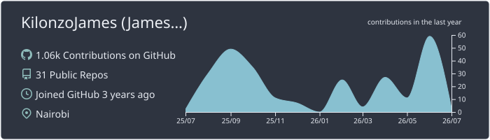
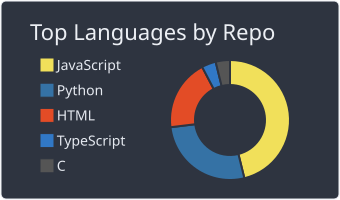
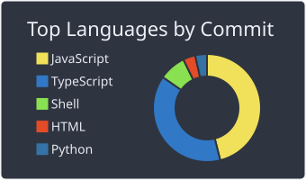
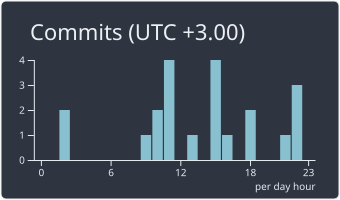
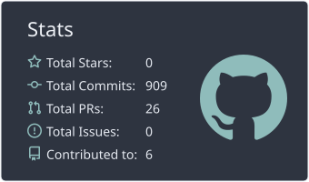

<!-- CLEAN MINIMAL EDITORIAL -->

<h1>KilonzoJames</h1>

  <strong>SOFTWARE ENGINEERING</strong>
  &nbsp;&nbsp;·&nbsp;&nbsp;
  <strong>CYBERSECURITY</strong>
  &nbsp;&nbsp;·&nbsp;&nbsp;
  <strong>CLOUD</strong>

<samp>Dependable software, designed for adversarial environments.</samp>

  <a href="https://linkedin.com/in/kilonzo-james">LinkedIn</a>
  &nbsp;&nbsp;·&nbsp;&nbsp;
  <a href="https://sevenly.vercel.app">Technical writing</a>
  &nbsp;&nbsp;·&nbsp;&nbsp;
  <a href="https://tryhackme.com/p/Sevenly">Security profile</a>

 

## 01 / Toolkit

<table width="100%">
  <tr>
    <td width="21%"><strong>Languages</strong></td>
    <td>Python · JavaScript · TypeScript · C · Assembly · Bash · SQL · HTML5 · CSS3</td>
  </tr>
  <tr>
    <td><strong>Applications</strong></td>
    <td>Flask · Django · FastAPI · React · Tailwind CSS · Bootstrap · Streamlit</td>
  </tr>
  <tr>
    <td><strong>Data</strong></td>
    <td>PostgreSQL · MySQL · SQLite · Amazon RDS · DynamoDB · Redis</td>
  </tr>
  <tr>
    <td><strong>Infrastructure</strong></td>
    <td>Git · GitHub Actions · Docker · Kubernetes · AWS · GCP</td>
  </tr>
  <tr>
    <td><strong>Applied AI</strong></td>
    <td>Pandas · NumPy · Scikit-learn · PyTorch · Matplotlib · Seaborn · LangChain</td>
  </tr>
  <tr>
    <td><strong>Security</strong></td>
    <td>Penetration Testing · Binary Exploitation · Reverse Engineering · Vulnerability Research · Web Exploitation · Incident Response · OS Hardening · SIEM</td>
  </tr>
  <tr>
    <td><strong>Web3</strong></td>
    <td>Smart Contracts · dApp Architecture · Contract Auditing · DeFi Protocols · Consensus Mechanisms</td>
  </tr>
</table>

 

  

  

 

## 02 / Engineering activity

<!-- SVGs generated by .github/workflows/profile-summary-cards.yml -->

  

  
  
  

  

 

---

<samp>OPEN TO THOUGHTFUL COLLABORATION IN SOFTWARE, SECURITY, AND OPEN SOURCE.</samp>

